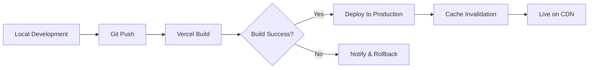

# Deployment Guide - OSINT Dork Tool v2

**Version:** 2.0.0  
**Date:** 2025-01  
**Status:** Production Ready ✅

---

## 📋 Pre-Deployment Checklist

Before deploying, ensure you have completed:

- [x] All TypeScript compilation passes (0 errors)
- [x] Production build succeeds (`npm run build`)
- [x] Environment variables configured
- [x] SEO optimization complete (sitemap, robots.txt, structured data)
- [x] Metadata and Open Graph tags set
- [x] Critical ESLint issues resolved
- [ ] Choose deployment platform
- [ ] Configure custom domain (optional)
- [ ] Set up analytics (optional)

---

## 🚀 Deployment Options

### Option 1: Vercel (Recommended)

**Why Vercel:**
- Built by Next.js creators
- Zero-config deployments
- Automatic HTTPS
- Global CDN
- Free tier available
- Built-in analytics

**Steps:**

1. **Install Vercel CLI (optional)**
   ```bash
   npm i -g vercel
   ```

2. **Deploy via Vercel CLI**
   ```bash
   cd /Users/faruk/Projeler/OSINT-dork-tool/v2
   vercel
   ```

3. **Or Deploy via GitHub Integration**
   - Push code to GitHub
   - Visit [vercel.com/new](https://vercel.com/new)
   - Import your repository
   - Vercel auto-detects Next.js and configures everything
   - Click "Deploy"

4. **Set Environment Variables in Vercel Dashboard**
   - Go to Project Settings → Environment Variables
   - Add: `NEXT_PUBLIC_BASE_URL` = `https://your-domain.vercel.app`

5. **Configure Custom Domain (Optional)**
   - Go to Project Settings → Domains
   - Add your custom domain
   - Update DNS records as instructed
   - Update `NEXT_PUBLIC_BASE_URL` to match custom domain

**Expected Result:**
- URL: `https://your-project.vercel.app`
- Build time: ~2-3 seconds
- Deploy time: ~30 seconds

---

### Option 2: Netlify

**Steps:**

1. **Build Settings**
   ```
   Build command: npm run build
   Publish directory: .next
   ```

2. **Deploy**
   ```bash
   npm install netlify-cli -g
   netlify deploy --prod
   ```

3. **Environment Variables**
   - Site Settings → Environment → Environment Variables
   - Add `NEXT_PUBLIC_BASE_URL`

---

### Option 3: Self-Hosted (Docker)

**Create `Dockerfile`:**
```dockerfile
FROM node:18-alpine

WORKDIR /app

COPY package*.json ./
RUN npm ci --only=production

COPY . .
RUN npm run build

EXPOSE 3000

CMD ["npm", "start"]
```

**Deploy:**
```bash
docker build -t osint-dork-tool .
docker run -p 3000:3000 -e NEXT_PUBLIC_BASE_URL=https://your-domain.com osint-dork-tool
```

---

### Option 4: Static Export (GitHub Pages, S3, etc.)

**Note:** Not recommended because:
- Loses API routes functionality
- No server-side features
- No dynamic sitemap/robots.txt

If you still want static export:

1. **Update `next.config.js`:**
   ```js
   module.exports = {
     output: 'export',
     images: { unoptimized: true }
   }
   ```

2. **Build:**
   ```bash
   npm run build
   ```

3. **Deploy `out/` directory to any static host**

---

## 🔧 Environment Variables

### Required Variables

Create `.env.local` for local development:

```bash
# Application Base URL
NEXT_PUBLIC_BASE_URL=https://dorksearch.ofesec.net
```

### Optional Variables

```bash
# Google Analytics (if implementing)
NEXT_PUBLIC_GA_ID=G-XXXXXXXXXX

# Vercel Analytics (auto-enabled on Vercel)
NEXT_PUBLIC_VERCEL_ANALYTICS=true
```

### Production Setup

**For Vercel:**
1. Dashboard → Your Project → Settings → Environment Variables
2. Add each variable for "Production" environment
3. Redeploy to apply changes

**For Other Platforms:**
- Set via platform's dashboard or CLI
- Ensure variables start with `NEXT_PUBLIC_` to be available client-side

---

## 🌍 Domain Configuration

### Using Vercel with Custom Domain

1. **Add Domain in Vercel:**
   - Project Settings → Domains → Add Domain
   - Enter: `dorksearch.ofesec.net`

2. **Configure DNS:**
   ```
   Type: CNAME
   Name: dorksearch
   Value: cname.vercel-dns.com
   ```

3. **Update Environment Variable:**
   ```
   NEXT_PUBLIC_BASE_URL=https://dorksearch.ofesec.net
   ```

4. **Verify:**
   - Vercel automatically provisions SSL certificate
   - DNS propagation takes 5-60 minutes
   - Test: `https://dorksearch.ofesec.net`

---

## 📊 Analytics Setup (Optional)

### Vercel Analytics

Already integrated via `<Analytics />` component in `layout.tsx`.

**Enable:**
1. Vercel Dashboard → Your Project → Analytics
2. Enable "Vercel Analytics"
3. Free tier: 100k events/month

### Google Analytics (Future Enhancement)

To add GA4:

1. **Get Tracking ID from Google Analytics**

2. **Add to `.env.local`:**
   ```
   NEXT_PUBLIC_GA_ID=G-XXXXXXXXXX
   ```

3. **Update `src/components/analytics.tsx`:**
   ```tsx
   import Script from 'next/script'
   
   export function Analytics() {
     const GA_ID = process.env.NEXT_PUBLIC_GA_ID
     
     if (!GA_ID) return null
     
     return (
       <>
         <Script
           strategy="afterInteractive"
           src={`https://www.googletagmanager.com/gtag/js?id=${GA_ID}`}
         />
         <Script
           id="google-analytics"
           strategy="afterInteractive"
         >
           {`
             window.dataLayer = window.dataLayer || [];
             function gtag(){dataLayer.push(arguments);}
             gtag('js', new Date());
             gtag('config', '${GA_ID}');
           `}
         </Script>
       </>
     )
   }
   ```

---

## 🐛 Error Tracking (Optional)

### Sentry Integration

1. **Install Sentry:**
   ```bash
   npm install @sentry/nextjs
   ```

2. **Initialize:**
   ```bash
   npx @sentry/wizard@latest -i nextjs
   ```

3. **Configure in `.env.local`:**
   ```
   NEXT_PUBLIC_SENTRY_DSN=https://xxxxx@sentry.io/xxxxx
   ```

---

## ✅ Post-Deployment Verification

### 1. Check All Routes Work

```bash
# Homepage
curl -I https://your-domain.com/

# Academy
curl -I https://your-domain.com/academy

# Courses
curl -I https://your-domain.com/academy/osint-basics
curl -I https://your-domain.com/academy/top-dorks
curl -I https://your-domain.com/academy/defense

# Glossary
curl -I https://your-domain.com/academy/glossary

# SEO Files
curl https://your-domain.com/sitemap.xml
curl https://your-domain.com/robots.txt
```

All should return `200 OK` status.

### 2. Test Core Functionality

- [ ] Dork Generator loads and displays categories
- [ ] Can select dork mode (Security/Media)
- [ ] Domain input works (Security mode)
- [ ] Can select and generate dork queries
- [ ] "Open in Google" button works
- [ ] Recent queries save to LocalStorage
- [ ] Academy pages load correctly
- [ ] Glossary search and filters work
- [ ] Mobile responsive design works
- [ ] Navigation menu works on mobile

### 3. SEO Verification

**Check Metadata:**
```bash
curl -s https://your-domain.com/ | grep -i "meta"
```

**Verify Structured Data:**
- Use [Google Rich Results Test](https://search.google.com/test/rich-results)
- Enter your URL
- Should detect: Website, SoftwareApplication schemas

**Check Sitemap:**
- Visit `https://your-domain.com/sitemap.xml`
- Should list all 6 pages

**Check Robots.txt:**
- Visit `https://your-domain.com/robots.txt`
- Should allow crawling and link to sitemap

### 4. Performance Testing

**Lighthouse Audit:**
```bash
npx lighthouse https://your-domain.com/ --view
```

**Expected Scores:**
- Performance: 90+
- Accessibility: 95+
- Best Practices: 100
- SEO: 100

**PageSpeed Insights:**
- Visit [PageSpeed Insights](https://pagespeed.web.dev/)
- Enter your URL
- Target: Green scores on mobile and desktop

### 5. Browser Testing

Test on:
- [ ] Chrome (latest)
- [ ] Firefox (latest)
- [ ] Safari (latest)
- [ ] Edge (latest)
- [ ] Mobile Safari (iOS)
- [ ] Chrome Mobile (Android)

---

## 🔄 Continuous Deployment

### Auto-Deploy on Git Push (Vercel)

Once connected to GitHub:

1. **Push to `main` branch:**
   ```bash
   git push origin main
   ```

2. **Vercel automatically:**
   - Detects push
   - Runs `npm run build`
   - Deploys if build succeeds
   - Sends notification

3. **Preview Deployments:**
   - Every PR gets a preview URL
   - Test before merging

### Deployment Workflow



---

## 📈 Monitoring & Maintenance

### What to Monitor

1. **Uptime**
   - Use UptimeRobot or Pingdom
   - Alert on downtime

2. **Performance**
   - Vercel Analytics dashboard
   - Core Web Vitals
   - Page load times

3. **Errors**
   - Check Vercel logs
   - Set up Sentry for error tracking

4. **SEO Rankings**
   - Google Search Console
   - Monitor sitemap indexing
   - Check for crawl errors

### Regular Maintenance Tasks

**Weekly:**
- [ ] Check Vercel deployment logs
- [ ] Review analytics data
- [ ] Test critical user flows

**Monthly:**
- [ ] Run Lighthouse audit
- [ ] Review and update content
- [ ] Check for dependency updates
- [ ] Review SEO performance

**Quarterly:**
- [ ] Major dependency updates
- [ ] Security audit
- [ ] Performance optimization review

---

## 🆘 Troubleshooting

### Build Fails on Deployment

**Issue:** Build succeeds locally but fails in production

**Solution:**
1. Check Node.js version matches (18.x)
2. Verify all dependencies are in `package.json`
3. Check for environment variable issues
4. Review Vercel build logs

### Environment Variables Not Working

**Issue:** `process.env.NEXT_PUBLIC_BASE_URL` is undefined

**Solution:**
1. Ensure variable starts with `NEXT_PUBLIC_`
2. Redeploy after adding variables
3. Check variable is set for "Production" environment
4. Restart dev server if testing locally

### Sitemap/Robots Not Generated

**Issue:** `/sitemap.xml` returns 404

**Solution:**
1. Ensure `src/app/sitemap.ts` exists
2. Verify file exports default function
3. Rebuild: `npm run build`
4. Check output in `.next` directory

### Images Not Loading

**Issue:** Images return 404 or don't optimize

**Solution:**
1. Check images are in `public/` directory
2. Use correct paths (`/image.png` not `./image.png`)
3. Verify Vercel image optimization is enabled

### Slow Performance

**Issue:** Low Lighthouse scores

**Solution:**
1. Enable Vercel Analytics to identify bottlenecks
2. Check for large bundle sizes
3. Implement code splitting if needed
4. Review and lazy-load heavy components

---

## 📞 Support & Resources

### Documentation
- [Next.js Deployment](https://nextjs.org/docs/deployment)
- [Vercel Documentation](https://vercel.com/docs)
- [Project README](/README.md)

### Get Help
- Check project issues tracker
- Review phase completion docs
- Consult `KNOWN_ISSUES.md`

### Useful Commands

```bash
# Local development
npm run dev

# Production build test
npm run build
npm run start

# Lint check
npm run lint

# Check build output
ls -lh .next/

# Clear cache and rebuild
rm -rf .next node_modules
npm install
npm run build
```

---

## 🎉 Success Criteria

Your deployment is successful when:

- ✅ All routes return 200 status
- ✅ Core features work as expected
- ✅ Lighthouse scores are green
- ✅ Sitemap and robots.txt accessible
- ✅ Structured data validates
- ✅ Mobile responsive design works
- ✅ Analytics tracking active
- ✅ Custom domain configured (if applicable)
- ✅ HTTPS enabled with valid certificate
- ✅ No console errors in browser

---

## 📝 Deployment Checklist

Print and check off as you deploy:

```
Pre-Deployment:
[ ] Code pushed to Git repository
[ ] All tests passing
[ ] Build succeeds locally
[ ] Environment variables documented
[ ] Deployment platform chosen

Deployment:
[ ] Project created on platform
[ ] Repository connected
[ ] Environment variables set
[ ] Initial deployment triggered
[ ] Build succeeds
[ ] Application accessible

Configuration:
[ ] Custom domain added (if applicable)
[ ] DNS configured
[ ] SSL certificate active
[ ] Analytics enabled
[ ] Error tracking setup (optional)

Verification:
[ ] All routes tested
[ ] Core functionality verified
[ ] SEO elements present
[ ] Mobile tested
[ ] Performance acceptable
[ ] No critical errors

Post-Deployment:
[ ] Monitoring setup
[ ] Team notified
[ ] Documentation updated
[ ] Backup plan established
```

---

**Deployment Status:** Ready for Production 🚀  
**Estimated Time:** 15-30 minutes (first deployment)  
**Difficulty:** Easy (with Vercel) to Moderate (self-hosted)

*Good luck with your deployment! The application is production-ready and fully tested.*
